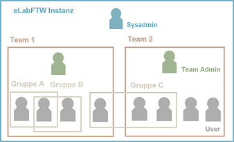
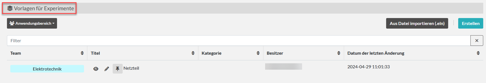

# eLabFTW - Überblick + Vorstellung

## Worum geht es hier?
Diese Webseite bietet einen Überblick zum Elektronischen Laborbuch eLabFTW, um Wissenschaftler*innen ohne Vorerfahrung das Konzept und die Darstellung einzelner Funktionen vorzustellen. Einführungen in die Nutzung von eLabFTW ist in den [weiterführenden Informationen](#weiterführende-informationen) zu finden.

## Was ist ein Elektronisches Laborbuch (ELB)?
Ein ELB ist eine digitale Plattform für Forschungsaktivitäten. Es kann für die Planung, Durchführung, Dokumentation und Auswertung von Experimenten genutzt werden. Ebenso können Materialien und Geräte verwaltet werden.

eLabFTW ist ein Elektronisches Laborbuch, das fachübergreifend eingesetzt werden kann. 

## Struktur und Aufbau
Die Zusammenarbeit in eLabFTW erfolgt in Teams, die von Team Admins organisiert und strukturiert werden. Eine Instanz von eLabFTW wird von einem Sysadmin betreut, der u.a. die Erstellung von Teams übernimmt. Team Admins verwalten registrierte Nutzer*innen für ein Team. Durch die Erstellung von Gruppen ist auch teamübergreifende Arbeit möglich.

## Dashboard
Das Dashboard gibt einen Überblick über Inhalte und Aktivitäten eines Teams.

**Experimente**  
Experimente können durch Kategorien strukturiert werden. Statusangaben weisen auf den Fortschritt eines Experimentes hin. Neue Experimente können mit oder ohne Vorlage neu erstellt werden.

**Ressourcen**  
Mit Ressourcen können verschiedene Kategorien von Materialien oder Geräten, die in Experimenten Verwendung finden, organisiert und verknüpft werden.

**Buchungen**  
Für Ressourcen gibt es eine Buchungsfunktion, sodass Teammitglieder über eine Kalenderfunktion diese nutzen können.

## Experimente

Ein Experiment kann zur Strukturierung einer definierten **Kategorie** zugeordnet werden. 

Der **Status** kann je nach Fortschritt des Experiments angepasst werden.

Für Experimente können **Vorlagen** erstellt werden, sodass die Dokumentation vereinheitlicht und das Ausfüllen vereinfacht wird.

Ein **Editor** ermöglicht die Dokumentation der Durchführung und Ergebnisse des Experimentes. 

Für ein Experiment können einzelne **Schritte** definiert und je nach Erledigung markiert werden. 

Die für dieses Experiment notwendigen Ressourcen können verknüpft werden, sodass dadurch Details abrufbar sind.

**Dateianhänge** ermöglichen die Ablage von weiteren Informationen oder Bildern zum Experiment.

## Kategorien

Team Admins können Kategorien für Experimente und Ressourcen festlegen und farblich unterscheidbar machen. So erhalten Experimente und Ressourcen eine übersichtliche Struktur.

## Weitere Funktionen
eLabFTW bietet weitere Funktionen zum Bearbeiten und Abschließen von Experimenten, u.a.: 

- Volltextsuche
- Terminplaner für Teams
- Neue Felder mit JSON
- Formeln mit TeXCommand
- Versionierung
- Zeitstempel
- Export

## Weiterführende Informationen
Einführungsvideos in die Nutzung von eLabFTW: [OER.DigiChem.NRW](https://av.tib.eu/series/1590/oer+digichem+elabftw)

